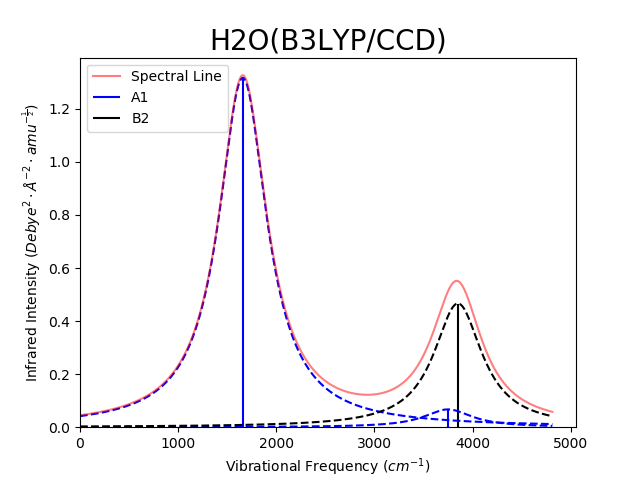
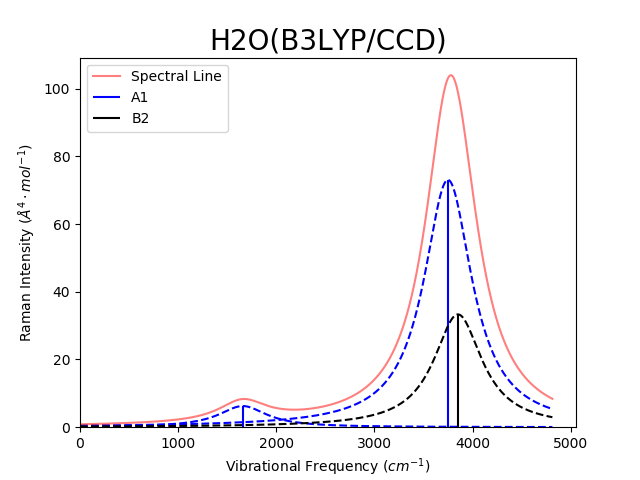

[](https://doi.org/10.21105/joss.01612)

If you use AutoGAMESS for any published research, please cite it in the following or similar manner:

```
AutoGAMESS[1] was used for workflow automation.

[1] Ferrari, Brian. "AutoGAMESS: A Python package for automation of GAMESS (US) Raman calculations." Journal of Open Source Software 4.41 (2019): 1612.
```

This is a python module for automating  the generation of input files and parsing of log files with end goal of generating Raman data using the [GAMESS(us)](https://www.msg.chem.iastate.edu/gamess/) Quantum Chemistry software.

This package was developed using `GAMESS VERSION = 20 APR 2017 (R1)`, it has also been partially tested for use with `GAMESS VERSION =  1 MAY 2013 (R1)` and `GAMESS VERSION = 14 FEB 2018 (R1)`.

AutoGAMESS is also able to generate line plots of vibrational frequency vs. IR/Raman intensities. Generated plots will be titled with the molecule name in the file and the theory/basis set used for the calculation. Each symmetry group will be plotted in a different color, from either a default or user specified color list. The spectral line (sum of line broadening) will also be plotted in red with 50% transparency. An example is shown bellow using Lorentzian line broadening method with the default sigma option.

IR Line Plot | Raman Line Plot
-------------|----------------
 | 
